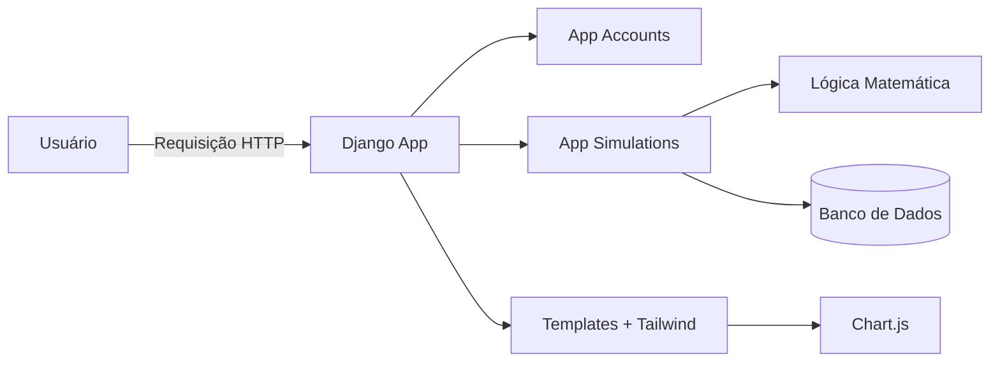
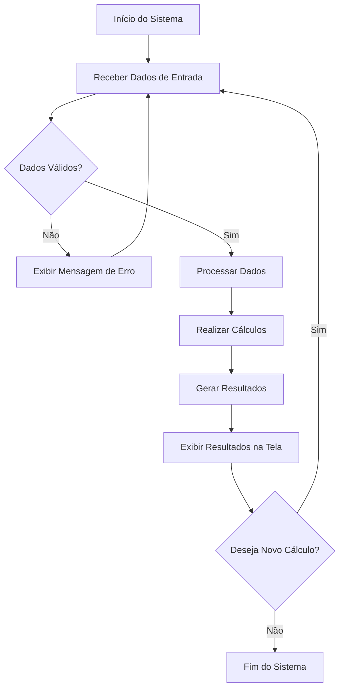

# MetaSim 💎

Plataforma SaaS de Simulação Financeira com Modelagem Matemática

---

## 🏗 Arquitetura do Sistema



---

## 📌 Sobre o Projeto

O **MetaSim** é um MicroSaaS desenvolvido para simulação de cenários financeiros utilizando modelagem matemática baseada em juros compostos e variação probabilística controlada.

A plataforma permite que usuários criem projeções de crescimento de capital, comparem cenários e visualizem resultados por meio de dashboards gráficos.

> ⚠️ O sistema não fornece recomendação de investimentos. Atua exclusivamente como ferramenta de apoio à decisão baseada em simulação matemática.

---
## ⚙️ Funcionamento do Sistema



## 🎯 Objetivo

Este projeto foi desenvolvido com o objetivo de:

- Aplicar modelagem matemática em software
- Estruturar um MicroSaaS com Django
- Implementar simulação determinística e probabilística
- Desenvolver controle de planos (Free e Premium)
- Construir um dashboard analítico com visualização gráfica
- Demonstrar organização arquitetural e boas práticas backend

---

## 🧠 Conceitos Aplicados

### ✔ Juros Compostos Iterativos

Cálculo mensal:

Valorₙ = Valorₙ₋₁ × (1 + taxa_mensal) + aporte

---

### ✔ Cenários Comparativos

- Pessimista (taxa - 2%)
- Realista (taxa base)
- Otimista (taxa + 2%)

---

### ✔ Simulação Probabilística

Variação aleatória controlada da taxa mensal:

taxa_real = taxa_base + variação_aleatória

Essa abordagem introduz comportamento não linear e simulação de volatilidade simplificada.

---

## 💰 Sistema de Planos

### 🟢 Plano Free
- Até 3 simulações salvas
- Sem acesso à simulação probabilística

### 🔵 Plano Premium
- Simulações ilimitadas
- Acesso à simulação probabilística
- Funcionalidades futuras avançadas

---

## 📊 Funcionalidades do MVP

- Cadastro e autenticação de usuários
- Criação de simulações financeiras
- Projeção determinística
- Comparação de cenários
- Simulação probabilística
- Dashboard com gráficos
- Persistência de dados por usuário
- Controle de acesso baseado em plano

---

## 📅 Roadmap

- [x] Estrutura inicial do projeto
- [ ] Modelagem do banco de dados
- [ ] Implementação da simulação determinística
- [ ] Implementação de cenários comparativos
- [ ] Implementação da simulação probabilística
- [ ] Dashboard com gráficos
- [ ] Sistema de planos
- [ ] Deploy

---

## 🚀 Como Executar o Projeto

```bash
# Clonar repositório
git clone https://github.com/seu-usuario/metasim.git

# Criar ambiente virtual
python -m venv venv

# Ativar ambiente virtual
# Windows
venv\Scripts\activate
# Linux/Mac
source venv/bin/activate

# Instalar dependências
pip install -r requirements.txt

# Aplicar migrações
python manage.py migrate

# Rodar servidor
python manage.py runserver
```

---

## 📌 Status do Projeto

🚧 Em desenvolvimento

---

## 👩‍💻 Desenvolvido por

Vanderléia Mello  
Estudante de Engenharia Elétrica e Desenvolvedora em formação  

Projeto desenvolvido como MicroSaaS para demonstração técnica de modelagem matemática aplicada.
